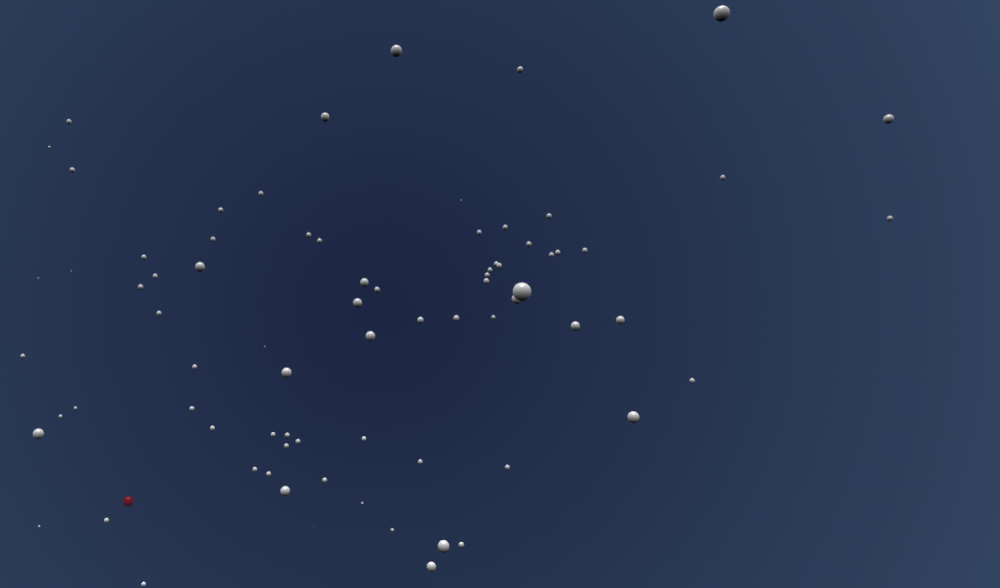
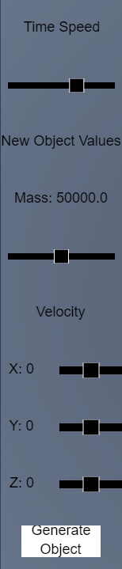
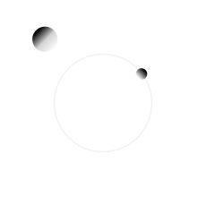

# Solar-System-Simulator

The Solar System Simulator gives you the opportunity to create your own objects with mass and observe how those objects
interact using the force of gravity.

## Installation Instructions
Simply download the code files and unzip into the same directory. Run the HTML file in a web browser of your choice.

## Usage
Create and destroy to your heart's content! If you enjoy learning and want to observe how mass, velocity, distance, and other variables affect orbits, then this is your app.

## Features
You can:
* Create objects
* Watch Orbits
* Create systems of particles and objects.

## Controls and How to Play
Use the control keys to move the red crosshair to where you want to place a new object.
### Movement Keys
W: move crosshair up.
A: move crosshair to the left.
D: move crosshair to the right.
S: move crosshair down.
Q: move the crosshair away from the screen.
E: move the crosshair towards the screen.

### Sliders
On the left side of the screen are sliders to change values of the object that you want to generate.

#### Time Speed Slider:
Move the slider to the left to slow down time.
Move the slider to the right to speed up time.

#### Mass Slider:
Move the mass slider to the left to lower mass, meaning the object will have less gravitational "pull" towards other objects.
Move the mass slider to the right to increase mass, meaning the object will have more gravitational pull towards other objects.

#### Velocity Sliders
X slider: Move to the left to add velocity to the left and move it to the right to add velocity in the right direction.
Y slider: Move to the left to add velocity upwards and move it to the right to add velocity downwards.
Z slider: Move to the left to add velocity towards the screen and move it to the right to add velocity away from the screen.

## Image Testing
